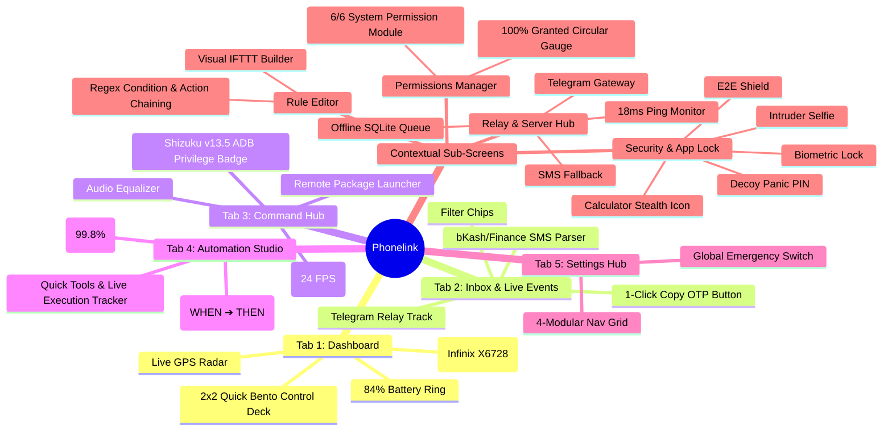
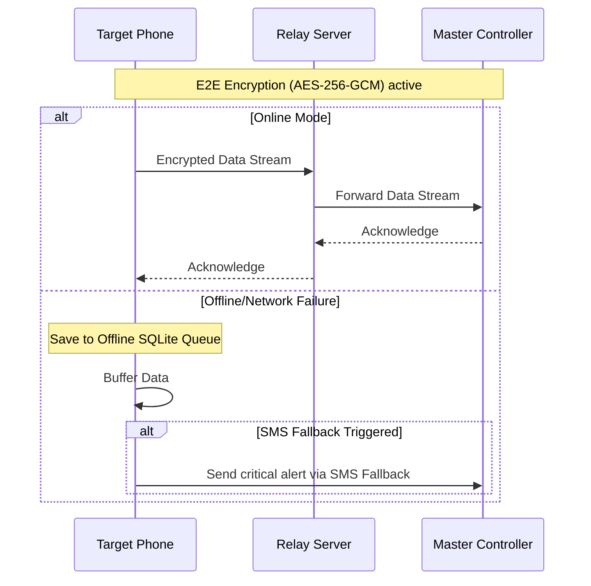

# Phonelink Architecture

## Information Architecture

```mermaid
mindmap
  root((Phonelink))
    Tab 1: Dashboard
      Paired Device (Infinix X6728)
      84% Battery Ring
      2x2 Quick Bento Control Deck
      Live GPS Radar
    Tab 2: Inbox & Live Events
      Filter Chips
      bKash/Finance SMS Parser
      1-Click Copy OTP Button
      Telegram Relay Track
    Tab 3: Command Hub
      Shizuku v13.5 ADB Privilege Badge
      Live Screen Mirroring (24 FPS)
      Audio Equalizer
      Remote Package Launcher
    Tab 4: Automation Studio
      Rule Engine Health (99.8%)
      IFTTT Cards (WHEN ➔ THEN)
      Quick Tools & Live Execution Tracker
    Tab 5: Settings Hub
      4-Modular Nav Grid
      Global Emergency Switch
    Contextual Sub-Screens
      Rule Editor
        Visual IFTTT Builder
        Regex Condition & Action Chaining
      Permissions Manager
        100% Granted Circular Gauge
        6/6 System Permission Module
      Security & App Lock
        E2E Shield
        Biometric Lock
        Decoy Panic PIN
        Calculator Stealth Icon
        Intruder Selfie
      Relay & Server Hub
        18ms Ping Monitor
        Telegram Gateway
        Offline SQLite Queue
        SMS Fallback
```

## Data Flow & Security Protocol

```mermaid
sequenceDiagram
    participant T as Target Phone
    participant R as Relay Server
    participant M as Master Controller

    Note over T,M: E2E Encryption (AES-256-GCM) active

    alt Online Mode
        T->>R: Encrypted Data Stream
        R->>M: Forward Data Stream
        M-->>R: Acknowledge
        R-->>T: Acknowledge
    else Offline/Network Failure
        Note over T: Save to Offline SQLite Queue
        T->>T: Buffer Data
        alt SMS Fallback Triggered
            T->>M: Send critical alert via SMS Fallback
        end
    end
```
